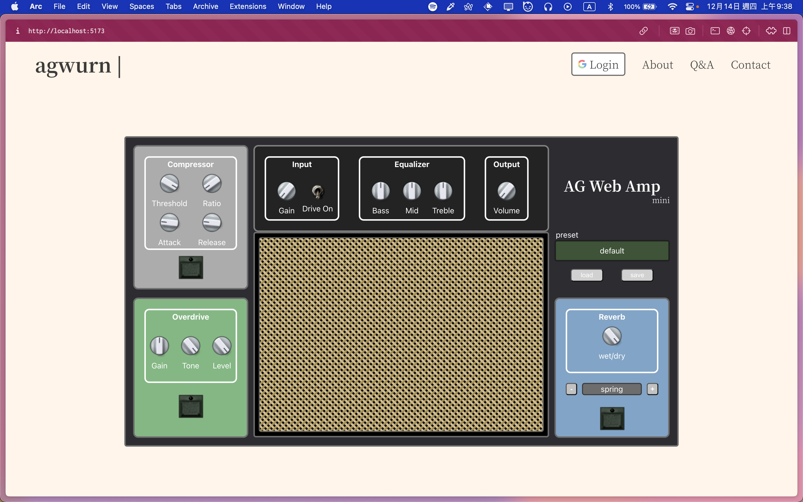
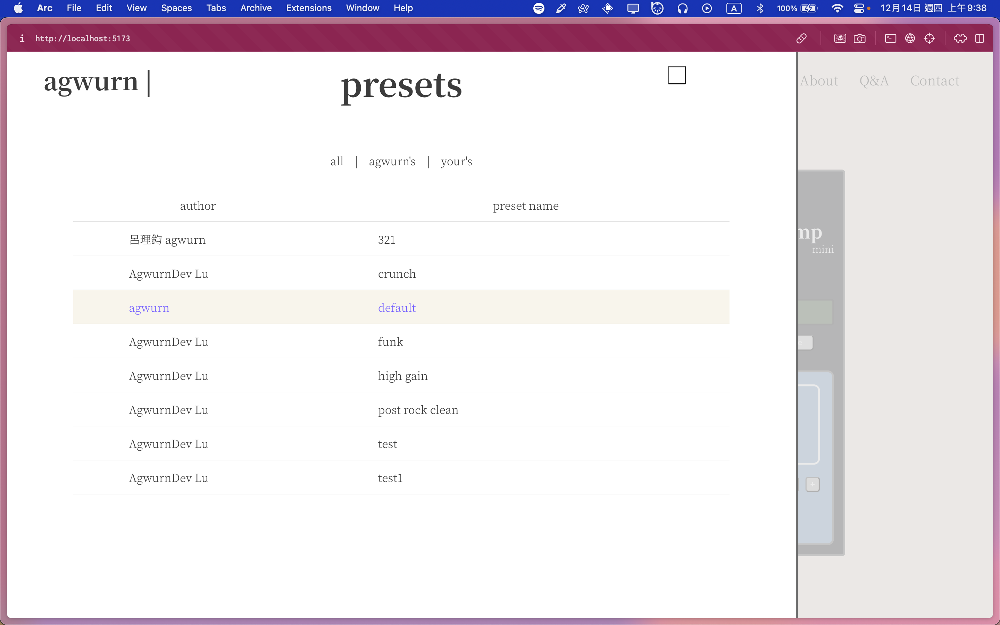

# ag-web-amp-mini

My personal side-project, a playable online guitar amp and effects.

## Requirement
- audio interface
- guitar

or you can test with computer mic, this app is based on audio input of your device.

## Current Feature
- realistic amp and effect pedal design
- google oauth login to save presets
- Effect｜4 knob Compressor
- Effect｜Mathematical algorithm Overdrive
- Effect｜3-band EQ
- Effect｜IR-based Reverb with spring, room, hall simulation.
- Amp｜IR-based Amp simulation

## Stack and Credit
- Web Audio API
- Vue 3
- SCSS
- [g200kg WebKnobMan](https://www.g200kg.com/en/webknobman/gallery.php)
- Heroicon
- Vite
- Firebase

## Future Works
- RWD support
- better menu
- preset style filter
 